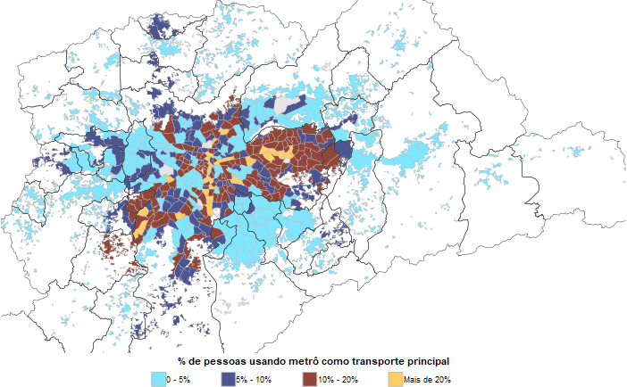
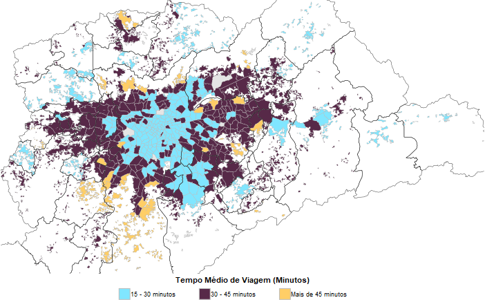

# Código completo do meu trabalho de mestrado para a matéria de Análise de Políticas Sociais (APS)!

## Título do artigo: Onde vamos hoje? Efeitos da integração da Linha 5-Lilás ao Metrô de São Paulo sobre as decisões de deslocamento dos indivíduos da Região Metropolitana de São Paulo

O objetivo do artigo é buscar entender o impacto da expansão da Linha 5-Lilás sobre as viagens ao centro expandido de São Paulo. A partir dos dados da Pesquisa de Origem e Destino (OD) de São Paulo dos anos de 2007 a 2023, foi empregado o método de Diferenças-em-Diferenças clássico, com somente dois períodos de tempo, quanto sua versão com múltiplos períodos de tempo (*Event Study*), utilizando os indivíduos com moradia localizada nas zonas contempladas pela Linha 5-Lilás original como tratamento. Para o contrafactual, foram criados três grupos de controle: O primeiro, a partir somente dos indivíduos em outras regiões da cidade que possuem, em suas zonas, acesso somente à linhas da CPTM; O segundo foi formado por indivíduos em zonas que, no futuro, serão contempladas com linhas novas do metrô; O último foi criado a partir de um *Propensity Score Matching* (PSM) com todos os indivíduos que elegíveis para controle, ou seja, que não moravam nas zonas iniciais da Linha 5.

### Mapas e tabelas ilustrativas do trabalho:

  
  
  
  

